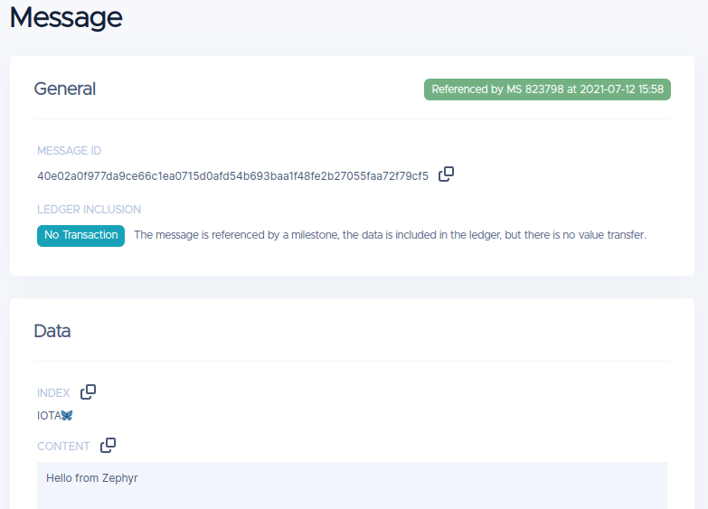

# IOTA Client Development Kit for Zephyr RTOS

This Software Development Kit(SDK) is a bundle of IOTA client library and Zephyr RTOS for IOTA client development.

Please visit [iota.c](https://iota-c-client.readthedocs.io/en/latest/index.html) and [Zephyr](https://docs.zephyrproject.org/latest/introduction/index.html) for more details.

# Hardware Requirements

The hardware requirements are depends on the use case, here are recommendations:

* 1MB Flash Memory
* 256KB SRAM
* True Random Number Generator
* HMAC-SHA Hardware Accelerator
* TCP/IP network stack with TLS support

# Demo Commands

## Show Connected Node Info - iota info

```shell
uart:~$ iota info
Name: HORNET
Version: 1.0.2
Network ID: testnet7
Bech32HRP: atoi
Message Pre Sec: 8.50
isHealthy: true
Latest Milestone Index: 823831
Confirmed Milestone Index: 823831
Pruning Milestone Index: 478476
Latest Milestone Timestamp: 1626077010
uart:~$
```
## Send Data Message - iota data

```shell
uart:~$ iota data "IOTA\xF0\x9F\xA6\x8B" "Hello from Zephyr"
Sending Index: "IOTA🦋", Message: "Hello from Zephyr"
message ID: 40e02a0f977da9ce66c1ea0715d0afd54b693baa1f48fe2b27055faa72f79cf5
uart:~$
```
The data message on the Explorer



## Get Address hash - iota addr

```shell
uart:~$ iota addr 0 5
Addr[0]
	9A8FAF470E963F7FE437F91BFBBF0661AFC9AC133DBDD8F880434337983197D6
	atoi1qzdglt68p6tr7llyxlu3h7alqes6ljdvzv7mmk8cspp5xducxxtav6e82tp
Addr[1]
	DA69A7E52C3FB876DC9F82C06F09A42985EC4D845313E6F0222DCC5EB9A489B3
	atoi1qrdxnfl99slmsakun7pvqmcf5s5ctmzds3f38ehsygkuch4e5jymxx3ksxk
Addr[2]
	C2217457DA87AC54142D69AE27B1036D7980F34C9D48D03941D6D3DE1B761914
	atoi1qrpzzazhm2r6c4q59456ufa3qdkhnq8nfjw535peg8td8hsmwcv3gtpj9cw
Addr[3]
	45F2109F119A993B77386C861B85CE02F2741EA9BD52FA887E0D270BF7E292F4
	atoi1qpzlyyylzxdfjwmh8pkgvxu9ecp0yaq74x74975g0cxjwzlhu2f0gluvshk
Addr[4]
	DE909573713212274463C792D61919AC02284497C4E2068EA273053AD087F1F6
	atoi1qr0fp9tnwyepyf6yv0re94serxkqy2zyjlzwyp5w5fes2wksslclvdw7t0u
uart:~$
```

## Get Balance by index - iota balance

```shell
uart:~$ iota balance 0 5
Addr[0]
	9A8FAF470E963F7FE437F91BFBBF0661AFC9AC133DBDD8F880434337983197D6
	atoi1qzdglt68p6tr7llyxlu3h7alqes6ljdvzv7mmk8cspp5xducxxtav6e82tp
balance: 29000000
Addr[1]
	DA69A7E52C3FB876DC9F82C06F09A42985EC4D845313E6F0222DCC5EB9A489B3
	atoi1qrdxnfl99slmsakun7pvqmcf5s5ctmzds3f38ehsygkuch4e5jymxx3ksxk
balance: 3000000
Addr[2]
	C2217457DA87AC54142D69AE27B1036D7980F34C9D48D03941D6D3DE1B761914
	atoi1qrpzzazhm2r6c4q59456ufa3qdkhnq8nfjw535peg8td8hsmwcv3gtpj9cw
balance: 7000000
Addr[3]
	45F2109F119A993B77386C861B85CE02F2741EA9BD52FA887E0D270BF7E292F4
	atoi1qpzlyyylzxdfjwmh8pkgvxu9ecp0yaq74x74975g0cxjwzlhu2f0gluvshk
balance: 1000000
Addr[4]
	DE909573713212274463C792D61919AC02284497C4E2068EA273053AD087F1F6
	atoi1qr0fp9tnwyepyf6yv0re94serxkqy2zyjlzwyp5w5fes2wksslclvdw7t0u
balance: 0
uart:~$
```

# Work with Zephyr

Please refer to [Getting Started with Zephyr](https://docs.zephyrproject.org/latest/getting_started/index.html) for setting up your development environment.

This is tested on [b_l4s5i_iot01a](https://docs.zephyrproject.org/latest/boards/arm/b_l4s5i_iot01a/doc/index.html) and [stm32f746g_disco](https://docs.zephyrproject.org/latest/boards/arm/stm32f746g_disco/doc/index.html) targets at this moment.

Zephyr targets can be found in [Supported Boards](https://docs.zephyrproject.org/latest/boards/index.html)

Set `ZEPHYR_BASE` before using Zephyr build system.

```shell
$ export ZEPHYR_BASE="~/zephyrproject/zephyr"
```

## Use `west` tool

```shell
# application configuration
$ west build -b b_l4s5i_iot01a -t menuconfig
# flash app to target board
$ west flash
```

## Use CMake and Ninja

```shell
# Use cmake to configure a Ninja-based buildsystem:
$ cmake -B build -GNinja -DBOARD=b_l4s5i_iot01a

# configure and flash application to target
$ ninja -C build menuconfig
$ ninja -C build flash
```

# Work with nRF-Connect SDK

Please refer to [Getting Started with nRF-Connect](https://developer.nordicsemi.com/nRF_Connect_SDK/doc/latest/nrf/getting_started.html) for setting up your development environment.

Set `ZEPHYR_BASE` before using Zephyr build system.

```shell
$ export ZEPHYR_BASE="~/nRF-Connect-SDK/zephyr"
$ west build -b nrf9160dk_nrf9160@1.0.0 -t menuconfig -- -DUNIT_TESTS=ON
# make sure ZTEST is enabled and stack size is big enough.
# CONFIG_ZTEST=y
# CONFIG_ZTEST_STACKSIZE=5120
$ west flash
```

Console output

```
*** Booting Zephyr OS build v2.6.0-rc1-ncs1  ***
====Unit Test on nrf9160dk_nrf9160====
Running test suite iota_crypto
===================================================================
START - test_blake2b
 PASS - test_blake2b in 0.146 seconds
===================================================================
START - test_HMACSHA
 PASS - test_HMACSHA in 0.3 seconds
===================================================================
Test suite iota_crypto succeeded
Running test suite iota_core
===================================================================
START - test_address_gen
 PASS - test_address_gen in 0.25 seconds
===================================================================
START - test_message_with_tx
 PASS - test_message_with_tx in 0.11 seconds
===================================================================
START - tx_essence_serialization
[tx_essence_serialize_length:106] an input is needed
 PASS - tx_essence_serialization in 0.6 seconds
===================================================================
Test suite iota_core succeeded
Running test suite iota_bench
===================================================================
START - bench_address_generating
Bench 100 address generation
	min(ms)	max(ms)	avg(ms)	total(ms)
	15	16	15.20	1520
 PASS - bench_address_generating in 1.533 seconds
===================================================================
Test suite iota_bench succeeded
===================================================================
PROJECT EXECUTION SUCCESSFUL
```
